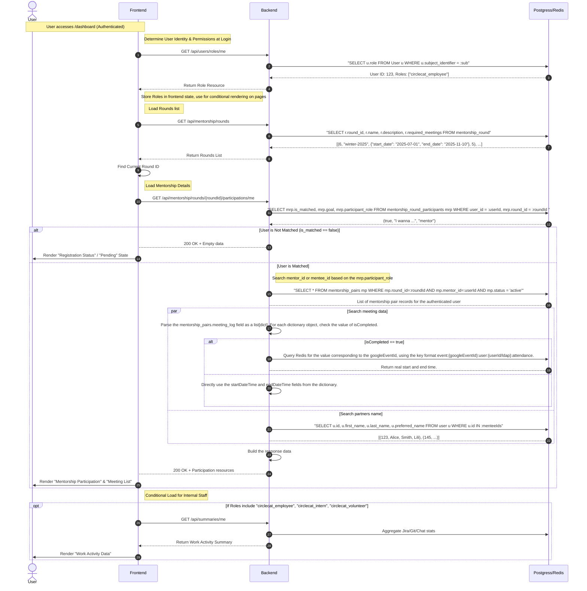

```mermaid
sequenceDiagram
    autonumber
    actor User
    participant FE as Frontend
    participant BE as Backend
    participant DB as Postgress/Redis

    Note over User, FE: User accesses /dashboard (Authenticated)

    %% Step 1: Bootstrap Identity
    Note right of FE: Determine User Identity & Permissions at Login
    FE->>BE: GET /api/users/roles/me
    BE->>DB: "SELECT u.role FROM User u WHERE u.subject_identifier = :sub"
    DB-->>BE: User ID: 123, Roles: ["circlecat_employee"]
    BE-->>FE: Return Role Resource
    Note right of FE: Store Roles in frontend state, use for conditional rendering on pages
    
    %% Step 2: Parallel Data Loading
    Note right of FE: Load Rounds list
    FE->>BE: GET /api/mentorship/rounds
    BE->>DB: "SELECT r.round_id, r.name, r.description, r.required_meetings FROM mentorship_round"
    DB-->>BE: [(6, "winter-2025", {"start_date": "2025-07-01", "end_date": "2025-11-10"}, 5), ...]
    BE-->>FE: Return Rounds List
    FE ->>FE: Find Current Round ID

    %% Step 3: Mentorship Data (Dependent on Round ID)
    Note right of FE: Load Mentorship Details
    FE->>BE: GET /api/mentorship/rounds/{roundId}/participations/me
    BE->>DB: "SELECT mrp.is_matched, mrp.goal, mrp.participant_role FROM mentorship_round_participants mrp WHERE user_id = :userId, mrp.round_id = :roundId "
    DB-->>BE: (true, "I wanna ...", "mentor")
    alt User is Not Matched (is_matched == false)
        BE-->FE: 200 OK + Empty data 
        FE->>User: Render "Registration Status" / "Pending" State
    else User is Matched 
        Note right of BE: Search mentor_id or mentee_id based on the mrp.participant_role
        BE->>DB: "SELECT * FROM mentorship_pairs mp WHERE mp.round_id=:roundId AND mp.mentor_id=:userId AND mp.status = 'active'"
        DB-->BE: List of mentorship pair records for the authenticated user
    
        par Search meeting data
            BE->>BE: Parse the mentorship_pairs.meeting_log field as a list[dict]. For each dictionary object, check the value of isCompleted.
            alt isCompleted == true
                BE->>DB: Query Redis for the value corresponding to the googleEventId, using the key format event:{googleEventId}:user:{userId/ldap}:attendance.
                DB-->BE: Return real start and end time.
            else
                BE->>BE: Directly use the startDateTime and endDateTime fields from the dictionary. 
            end
        and Search partners name
            BE->>DB: "SELECT u.id, u.first_name, u.last_name, u.preferred_name FROM user u WHERE u.id IN :menteeIds"
            DB-->BE: [(123, Alice, Smith, Lili), (145, ...)]
        end
            BE->>BE: Build the response data
            BE-->FE: 200 OK + Participation resources
            FE->>User: Render "Mentorship Participation" & "Meeting List"
    end
    %% Step 4: Work Activity (Dependent on Role)
    Note right of FE: Conditional Load for Internal Staff
    opt If Roles include "circlecat_employee", "circlecat_intern", "circlecat_volunteer" 
        FE->>BE: GET /api/summaries/me
        BE->>DB: Aggregate Jira/Git/Chat stats
        BE-->>FE: Return Work Activity Summary
        FE->>User: Render "Work Activity Data"
    end
```
