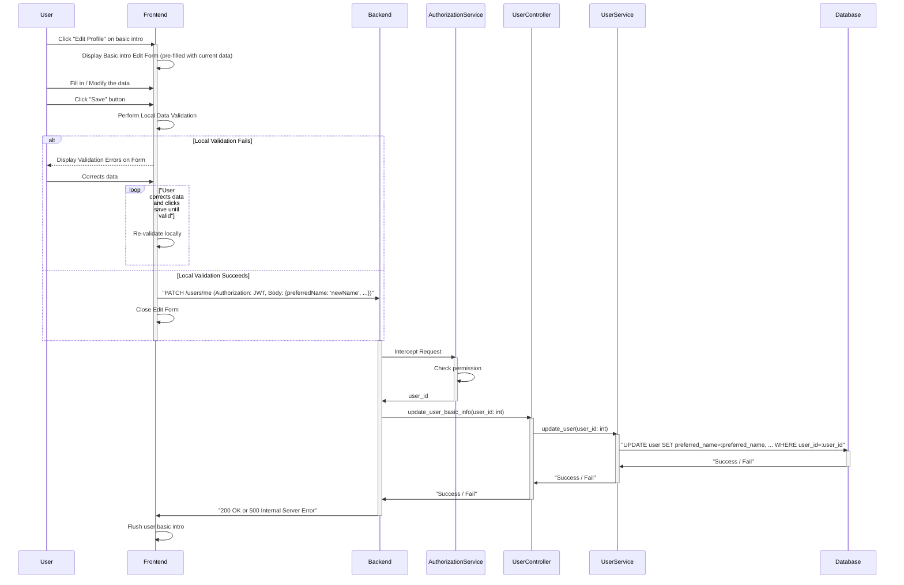

```mermaid
sequenceDiagram
    participant User
    participant Frontend
    participant BE as Backend
    participant AS as AuthorizationService
    participant UC as UserController
    participant US as UserService
    participant DB as Database

    User->>Frontend: Click "Edit Profile" on basic intro
    activate Frontend
    Frontend->>Frontend: Display Basic intro Edit Form (pre-filled with current data)
    User->>Frontend: Fill in / Modify the data
    User->>Frontend: Click "Save" button

    Frontend->>Frontend: Perform Local Data Validation
    alt Local Validation Fails
        Frontend-->>User: Display Validation Errors on Form
        User->>Frontend: Corrects data
        loop "User corrects data and clicks save until valid"
            Frontend->>Frontend: Re-validate locally
        end
    else Local Validation Succeeds
        Frontend->>BE: "PATCH /users/me (Authorization: JWT, Body: {preferredName: 'newName', ...})"
        Frontend->>Frontend: Close Edit Form
    end
    deactivate Frontend

    activate BE
    BE->>AS: Intercept Request
    activate AS
    AS->>AS: Check permission
    AS->>BE: user_id
    deactivate AS

    BE->>UC: update_user_basic_info(user_id: int)
    activate UC
    UC->>US: update_user(user_id: int)
    activate US
    US->>DB: "UPDATE user SET preferred_name=:preferred_name, ... WHERE user_id=:user_id"
    activate DB
    DB->>US: "Success / Fail"
    deactivate DB
    US->>UC: "Success / Fail"
    deactivate US
    UC->>BE: "Success / Fail"
    deactivate UC
    BE->>Frontend: "200 OK or 500 Internal Server Error"
    deactivate BE

    Frontend->>Frontend: Flush user basic intro
```